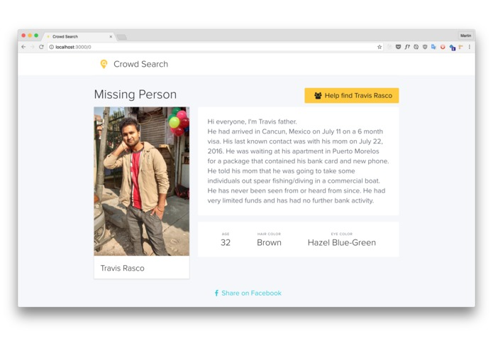
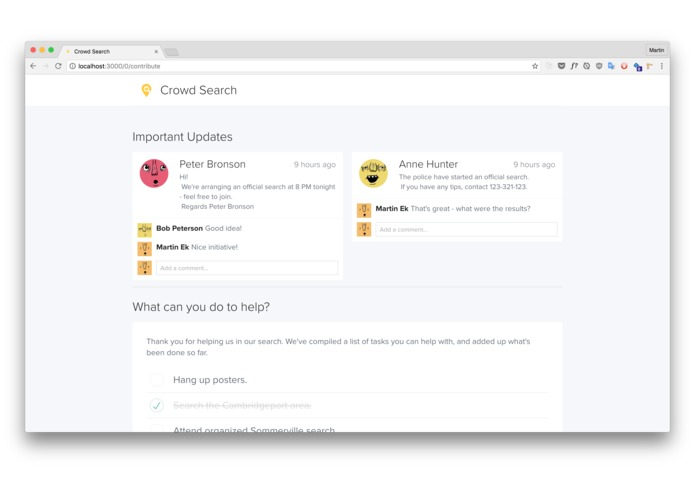

# hackmit-crowdsearch

## Inspiration
This week a 16 year old girl went missing outside Oslo, in Norway. Her parents posted about it on Facebook, and it was quickly shared by thousands of people. An immense amount of comments scattered around a large amount of Facebook posts consisted of people trying to help, by offering to hang up posters, aid in the search and similar. A Facebook group was started, and grew to over 15 000 people within a day. The girl was found, and maybe a few of the contributions helped?

<p align="center">
  
  
<p>
  
This is just one example, and similar events probably play out in a large number of countries and communities around the world. Even though Facebook is a really impressive tool for quickly sharing information like this across a huge network, it falls short on the other end - of letting people contribute to the search. Facebook groups are too linear, and has few tools that aid in making this as streamlined as possible. The idea is to create a platform that covers this.

## What it does
Crowd Search is split into two main parts:
* The first part displays structured information about the case, letting people quickly get a grasp of the situation at hand. It makes good use of rich media and UX design, and presents the data in an understandable way.
* The second part is geared around collaboration between volunteers. It allows the moderators of the missing person search to post information, updates and tasks that people can perform to contribute towards.

## How we built it
Crowd Search makes heavy use of Firebase, and is because of this a completely front-end based application, hosted on Firebase Hosting. The application itself is built using React. 

By using Firebase our application syncs updates in realtime, whether it's comments, new posts, or something as a simple as a task list checkbox. Firebase also lets us easily define a series of permission rules, to make sure that only authorized moderators and admins can change existing data and similar. Authentication is done using Facebook, through Firebase's authentication provider.

To make development as smooth as possible we make use of a series of utilities:
* We compile our JavaScript files with Babel, which lets us use new ECMAScript 2016+ features.
* We quality check our source code using ESLint (known as linting)
* We use Webpack to bundle all our JS and Sass files together into one bundle, which can then be deployed to any static file host (we're using Firebase Hosting).

## What's next for Crowd Search
The features presented here function as an MVP to showcase what the platform could be used for. There's a lot of possibilities for extension, with a few examples being:

* Interactive maps
* Situational timelines
* Contact information

## Setup
```bash
$ npm install
$ npm start
```

## Linting
ESLint is used to maintain high code quality and a unified code style.
To run the linter, use:
```
$ npm run lint
```
